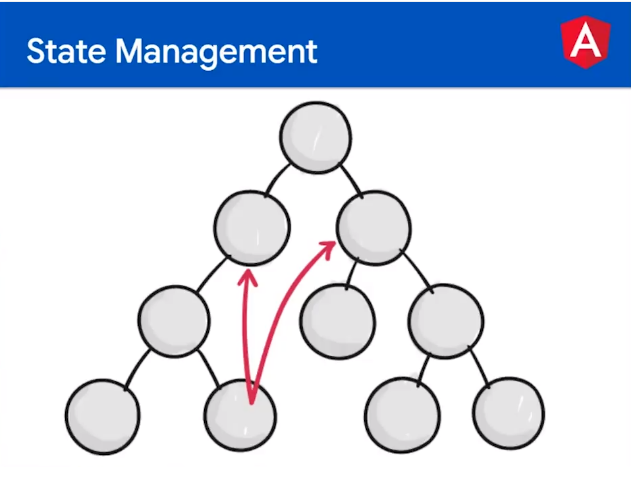
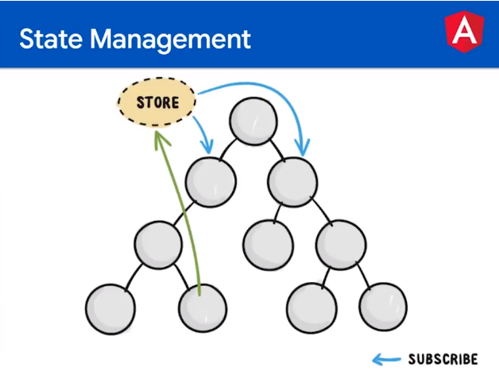

# Índice

-   INTRODUCCIÓN

    -   [Lectura que explica algunos conceptos importantes](#lectura-que-explica-algunos-conceptos-importantes)

-   COMPONENTES

    -   [Qué son los componentes](#qué-son-los-componentes)
    -   [Crea un componente](#crea-un-componente)

    -   Comunicación de componentes

        -   [Componente padre a hijo @input](#componente-padre-a-hijo-input)
        -   [Componente hijo al padre @output](#componente-hijo-al-padre-output)

    -   Ciclo de vida de componentes

        -   [Ciclo de vida](#ciclo-de-vida)
        -   [ngDestroy](#ngdestroy)

-   SERVICIOS

    -   [Qué son los servicios](#qué-son-los-servicios)
    -   [Crea un servicio](#crea-un-servicio)
    -   [Consumo de API con Angular](#consumo-de-api-con-angular)

-   PIPES

    -   [Qué son los Pipes](#qué-son-los-pipes)
    -   [Tipos de Pipes](#tipos-de-pipes)
    -   [Utilizando Pipes](#utilizando-pipes)
    -   [Construye tu propio pipe](#construye-tu-propio-pipe)

-   DIRECTIVAS

    -   [Qué son las Directivas](#qué-son-las-directivas)
    -   [Tu primera Directiva](#tu-primera-directiva)
    -   [Manipulando estilos](#manipulando-estilos)
    -   [Escuchando eventos](#escuchando-eventos)
    -   [Pasando datos a una directiva](#pasando-datos-a-una-directiva)

-   REACTIVIDAD BÁSICA

    -   [Qué es la Reactividad Básica](#qué-es-la-reactividad-básica)
    -   [Problemas en la comunicación de componentes](#problemas-en-la-comunicación-de-componentes)
    -   [Implementando un store de datos](#implementando-un-store-de-datos)

-   LINTERS
    -   [Qué son los linters](#qué-son-los-linters)
    -   [Implementación](#implementación)
    -   [La importancia del Linter](#la-importancia-del-linter)

## Qué son los componentes

-   Un componente es una pieza de software con una responsabilidad única y una estructura y funcionalidad determinada, además de ser reutilizable.

-   Es una manera de dividir tu aplicación de una forma escalable para no tener todo en un solo archivo. Por ejemplo, un componente para el header, otro para el footer, uno más para el menú, etc.

## Crea un componente

1. Puedes crear un componente completo en Angular utilizando el comando:

    ```BASH
        ng generate component test-name
        #O en su forma corta
        ng g c test-name
    ```

2. Si en algún caso, debes crear un componente muy básico, que no requiera un archivo de estilos, puedes añadir el flag “-is” que es “inline styles”, esto hace que no se genere un archivo de estilos:

    ```BASH
        ng g c componentes/img -is
    ```

3. También puedes usar --skip-tests para no crear el archivo de pruebas en caso de que no lo necesites:

    ```BASH
        ng g c componentes/img --skip-tests
    ```

4. O combinar flags para crear un componente con todo lo que exactamente necesitas:
    ```BASH
        ng g c componentes/img --skip-tests -is
    ```

## Componente padre a hijo @input

-   Sabiendo que el componente padre es app-root y el componente hijo es app-img

-   Desde el componente hijo tenemos el `[src]` ligado a una variable llamada `imgUrl`, ahí está la clave, `imgUrl` va a ser como el teléfono que permitirá la comunicación entre padre a hijo

```HTML
    
```

-   Desde el app-root, tomamos la propiedad que queremos cambiar sus datos, este caso `imgUrl` y le pasamos el nuevo valor que queremos cambiar.

```HTML
    <!-- Para pasarle datos directos -->
    <app-img imgUrl="Este es el nuevo valor enviado desde el padre"></app-img>

    <!-- Para pasarle datos desde una variable creada en app.component.ts -->
    <app-img [imgUrl]="ParentTitle"></app-img>
```

## Componente hijo al padre @output

-   Así como el decorador `@Input` permite el envío de información desde un componente padre hacia un componente hijo, el uso de `@Outputs` permite lo contrario, comunicación hijo a padre.

-   A partir de la emisión de un evento, el decorador `@Output()` permite enviar mensajes desde un componente hijo hacia el padre.

```
@Output
        dataflow
Hijo    ========>      Padre
```

-   Envío del mensaje

-   Para esto, se hace uso de la clase EventEmitter importándola desde @angular/core, para crear en tu componente una propiedad emisora de eventos.

    ```TypeScript
        import { Component, Output, EventEmitter } from '@angular/core';

        @Component({
        selector: 'app-test-name',
        templateUrl: './test-name.component.html',
        styleUrls: ['./test-name.component.less']
        })
        export class TestNameComponent {

        @Output() message = new EventEmitter<string>();

        constructor() { }
        }
    ```

-   Decorando la propiedad con el `@Output()` y creando una instancia de EventEmitter podrás emitir un evento de la siguiente manera:

    ```TypeScript
    emitirEvento() {
        this.message.emit('Hola soy Platzi');
    }
    ```

-   Llamando al método `emit()` de la instancia EventEmitter, se enviará el valor al componente padre que se encuentre escuchando el evento.
    Recepción del mensaje

-   Desde el componente padre, inicializa el componente hijo de la siguiente manera:

    ```HTML
    <app-test-name>
        (message)="recibirMensaje($event)"
    </app-test-name>
    ```

-   Se “bindea” la propiedad emisora de eventos con () y se le pasa una función que se ejecutará cada vez que emita un evento.
    Y en el componente padre:

    ```TypeScript
    import { Component } from '@angular/core';

    @Component({
        selector: 'app-father',
        templateUrl: './father.component.html',
        styleUrls: ['./father.component.less']
    })
    export class FatherComponent {

        constructor() { }

        recibirMensaje(event: Event) {
            console.log(event);
        }
    }
    ```

-   La función `recibirMensaje()` posee un parámetro del tipo Event que contendrá el mensaje del componente hijo.

## Ciclo de vida

-   Un componente pasa por varias etapas en su ciclo de vida. A través de hooks, puedes realizar una determinada acción cuando el componente es inicializado, cuando se dispara un evento, cuando se detecta un cambio, cuando el componente es destruido, etc.

-   Hooks más utilizados:

1. `Constructor`

    - Como en toda clase en la programación orientada a objetos, el constructor es quien crea la instancia del objeto y sus dependencias.

        - Solo se ejecuta una vez antes del render del componente.
        - No tiene que utilizarse para procesos asincrónicos.

2. `ngOnChanges`

    - El hook ngOnChanges() se dispara cada vez que se produce un cambio de estado en el componente. Cuando una variable cambia de valor, por ejemplo o ante el cambio de valor de un Input.

        - Se ejecuta N cantidad de veces antes y durante el render del componente.
        - Puede emplearse para procesos asincrónicos.

3. `ngOnInit`

    - Es el hook más usado, ngOnInit() es ideal para cualquier solicitud de datos asincrónicos a una API para preparar el componente antes de renderizarlo.

        - Únicamente se ejecuta una vez, antes del render del componente.
        - Puede usarse para procesos asincrónicos.

4. `ngAfterViewInit`

    - Este hook únicamente se ejecuta una vez cuando el render del componente haya finalizado. Puede serte útil para realizar acciones programáticas que requieran que todo el HTML del componente ya este preparado.

        - Únicamente se ejecuta una vez después del render del componente.

5. `ngOnDestroy`

    - Finalmente, ngOnDestroy() se ejecutará cuando el componente es destruido, o sea, cuando ya no existe en la interfaz del navegador. Suele utilizarse para liberar espacios de memoria que el componente requiera.

### Usando hook

    - Los hooks de ciclo de vida de Angular, son interfaces que tienen que importarse desde @angular/core para implementarlos en la clase y así detectar los cambios en cada evento.

```TypeScript
import { Component, OnInit, AfterContentInit, OnDestroy } from '@angular/core';

@Component({
    selector: 'app-test-name',
    templateUrl: './test-name.component.html',
    styleUrls: ['./test-name.component.less']
})

export class TestNameComponent implements OnInit, AfterContentInit, OnDestroy {

    constructor() {
        console.log('1. Primero sucederá esto');
    }

    ngOnChanges(): void {
        console.log('2. Luego esto');
    }

    ngOnInit(): void {
        console.log('3. Luego esto le sigue esto');
    }

    ngAfterViewInit(): void {
        console.log('4. Seguido de esto');
    }

    ngOnDestroy(): void {
        console.log('5. Finalmente esto (cuando el componente sea destruido)');
    }

}
```

## ngDestroy

-   El hook `ngOnDestroy()` tiene una importancia clave para el cuidado de nuestra aplicación. Su funcionalidad más importante es la liberación de espacio en memoria de variables para que no se acumule. Si esto llegara a suceder en tu aplicación, la misma podría volverse lenta y tosca a medida que toda la memoria del navegador es ocupada.

-   Para eliminar un componente es relativamente sencillo, simplemente debemos darle un condicional `*ngIf`, y dependiendo si es true o false, se eliminará ese componente.

```HTML
<app-img *ngIf="conditionalIsTrue"></app-img>
```

-   Peeeeeero, hagásmoslo más didáctico, usemos un botón para eliminar y agregar un componente al DOM.

```HTML
<!-- Este botón cuando lo presionemos eliminará o mostrará el componente -->
<button (click)="toogleImage()">Toogle image</button>

<!-- Aquí nos dirá si la variable es true or false -->
<span> {{ isTheImageShown }} </span>

<!-- Aquí está el componente que eliminará o mostrará dependiendo si la variable "isTheImageShown" es true or false  -->
<app-img *ngIf="isTheImageShown"></app-img>
```

-   Dentro de `app.component.ts` debe ir la variable booleana y la función del botón

```TypeScript
@Component({
    selector: 'app-root',
    templateUrl: './app.component.html',
    styleUrls: ['./app.component.css'],
})
export class AppComponent {
    isTheImageShown: boolean = true;

    toogleImage() {
        this.isTheImageShown = !this.isTheImageShown;
    }
}
```

-   Y listo, ya se eliminaría o se mostraría el componente. Sin embargo si estás haciendo uso de setInterval dentro de tu componente, este proceso seguirá ejecutándose aunque el componente se haya eliminado. Para solucionar este error, limpia el intervalo dentro de la función `ngOnDestroy()`, dentro del archivo `mismoComponente.component.ts`, mismo archivo donde se hace uso del `setInterval()`

```TypeScript
ngOnDestroy() {
    console.log('ngOnDestroy');
    clearInterval(this.yourInterval);
}
```

## Qué son los servicios

-   Un servicio es la forma que utiliza Angular para modular una aplicación y crear código reutilizable, este tendrá una determinada lógica de negocio que puede ser usada por varios componentes u otros servicios.

## Crea un servicio

1. Con el CLI de Angular, crea un servicio fácilmente con el comando:

    ```BASH
        ng generate service test-name
        #O en su forma corta
        ng g s test-name
    ```

-   Dicho comando creará dos archivos:

    -   test-name.service.ts => el servicio en sí.
    -   test-name.service.spec.ts => pruebas unitarias para testear el servicio.

## Utilizando un servicio

-   Paso 1: Agrégale al servicio algo de lógica, por ejemplo, una variable con un determinado valor para ser leído a través de un método:

```TypeScript
import { Injectable } from '@angular/core';
@Injectable({
    providedIn: 'root'
})
export class TestNameService {
    private testName = 'Hola Platzi';

    constructor() { }

    getTestName(): string {
        return this.testName;
    }
}
```

-   Paso 2: Luego, importa en un componente el servicio de la siguiente manera:

```Typescript
// components/catalogo/catalogo.component.ts
import { TestNameService } from 'src/app/services/test-name.service';

@Component({
    selector: 'app-catalogo',
    templateUrl: './catalogo.component.html',
    styleUrls: ['./catalogo.component.scss']
})
export class CatalogoComponent implements OnInit {
    // Creamos una instancia de nuestro servicio desde el constructor
    constructor(
        private testNameService: TestNameService,
    ) { }

    ngOnInit(): void {
        // Aquí ya estamos haciendo uso del servicio
        const name = this.testNameService.getTestName();
        console.log(name);
    }
}
```

-   En el constructor del componente, se inyecta el servicio para poder ser utilizado posteriormente.

-   En este ejemplo, estamos llamando en el ngOnInit() el método getTestName() del servicio para obtener el valor de una variable e imprimirla por consola.

-   De esta manera, puedes tener tu lógica de negocio en un servicio e importar este en N componentes, o incluso en otros servicios y acceder a sus métodos y propiedades.

## Consumo de API con Angular

-   Paso 1: Comienza importando el módulo HttpClientModule, en el módulo principal de tu aplicación `app.module.ts` desde `@angular/common/http`.

```TypeScript
// app.module.ts
import { HttpClientModule } from '@angular/common/http';

@NgModule({
    declarations: [
        // ..
    ],
    imports: [
        // ...
        HttpClientModule
    ],
    providers: [],
    bootstrap: [ /* .. */ ]
})
export class AppModule { }
```

-   Paso 2: Crea un servicio para realizar todos los llamados a una API que necesites. En este servicio tienes que importar el cliente HTTP de Angular y crear un método por cada endpoint para el que necesites efectuar una petición.

    ```BASH
    ng g s services/http
    ```

    ```TypeScript
    // services/http.service.ts
    import { HttpClient } from '@angular/common/http';

    @Injectable({
    providedIn: 'root'
    })
    export class HttpService {
        constructor(
            private http: HttpClient,
        ) { }

        getProducts() {
            return this.http.get(`https://example.com/api/productos`);
        }
    }
    ```

-   Paso 3: Importa este nuevo servicio en tus componentes para efectuar los llamados a la API.

```TypeScript
// components/catalogo/catalogo.component.ts
import { HttpService } from 'src/app/services/http.service';

@Component({
    selector: 'app-catalogo',
    templateUrl: './catalogo.component.html',
    styleUrls: ['./catalogo.component.scss']
})
export class CatalogoComponent implements OnInit {
    public productos: Producto[] = [];

    constructor(
        private HttpService: HttpService
    ) { }

    ngOnInit(): void {
        this.HttpService.getProducts()
            .subscribe(res => {
                this.productos = res;
            });
    }
}
```

-   El método ngOnInit() es el lugar apropiado para los llamados asincrónicos, recuerda que no es buena práctica hacerlo en el constructor.

-   Todo el cliente HTTP de Angular está basado en Observables, por lo tanto, es recomendable suscribirse al método del servicio para obtener los datos cuando la API responda.

-   TIP: No es necesario que hagas un .unsubscribe() luego del llamado a la API. Angular ya lo hace por ti, cuando usas su cliente HTTP.

## Qué son los Pipes

-   Los pipes nos permiten transformar visualmente nuestros datos, de esta manera podemos mostrar datos con una mejor experiencia de usuario, un ejemplo muy practico es el de la fecha, seguramente la mayoría de nosotros prefiere ver un formato de fecha como `6 may. 2017` en el lugar de `Sat May 06 2017 19:00:00 GMT-0500 (Hora est. Pacífico, Sudamérica)`.

## Tipos de Pipes

-   Angular posee por defecto algunos pipes que puedes utilizar para transformar números, fechas o cadenas de texto. Veamos los más importantes:

    -   DatePipe: Modifica fechas de acuerdo al formato necesitado.
    -   UpperCasePipe: Convierte todo el texto a mayúscula.
    -   LowerCasePipe: Convierte todo el texto en minúscula.
    -   CurrencyPipe: Convierte un número a la moneda o divisa necesitada.

-   Podrás encontrar todos los pipes disponibles en: `https://angular.io/api?status=stable&type=pipe`

## Utilizando Pipes

-   Los pipes se utilizan fácilmente en el HTML haciendo uso del carácter `|` seguido del nombre del pipe.

```HTML
<div>
  {{ "hola soy platzi" | uppercase }}
</div>
<div>
  {{ 1000 | currency:'USD' }}
</div>
```

-   En los ejemplos anteriores, se mostrará en la vista el testo HOLA SOY PLATZI completamente en mayúscula y el número 1000 en formato $1,000.00. En algunos casos, los pipes reciben parámetros de configuración, como el caso del pipe currency que recibe :'USD' para indicar el tipo de divisa.

-   Si quieres un tutorial más detalla, esta es tu web `https://aristotekean.medium.com/tipos-de-pipes-en-angular-d736079491b1`

## Construye tu propio pipe

-   Para poder afirmar que estás construyendo tu propio Pipe, es necesario hacer uso del CLI de Angular con el comando:

    ```BASH
        ng generate pipe test-name
        #O en su forma corta
        ng g p test-name
    ```

-   De la misma manera que lo hace con los servicios y componentes, el CLI creará un archivo .ts que contiene el código del pipe y un archivo .spec.ts para sus respectivas pruebas unitarias.

```TypeScript
// pipes/test-name.pipe.ts
import { Pipe, PipeTransform } from '@angular/core';

@Pipe({
    name: 'testName'
})
export class TestNamePipe implements PipeTransform {
    transform(value: unknown, ...args: unknown[]): unknown {
        return null;
    }
}
```

-   El pipe ya trae algo de código y configuraciones por defecto. Tendrás que cambiar los unknown por el tipeado que necesites dependiendo el pipe que estés generando.

-   Es importante observar el decorador @Pipe() que contiene el nombre del pipe, para así poder llamarlo en tu HTML.
-   Y no olvides importar el pipe en el módulo de tu aplicación para que este pueda ser utilizado.

```TypeScript
// app.module.ts
import { TestNamePipe } from './pipes/test-name.pipe';
@NgModule({
    declarations: [
    // ...
    TestNamePipe,
    ],
    imports: [
    // ...
    ],
    providers: [],
    bootstrap: [ /* ... */ ]
})
export class AppModule { }
```

## Qué son las Directivas

-   Angular utiliza el concepto de directiva para cambiar la apariencia o el comportamiento de un elemento en el HTML. Acá estaremos conociendo las directivas.

## Tu primera Directiva

Para crear tu primera directiva, es necesario usar el CLI de Angular con el comando:

    ```BASH
        ng generate directive test-name
        # O en su forma corta
        ng g d test-name
    ```

-   Al igual que con los servicios y los pipelines, el comando CLI creará un archivo .ts con el código de tu directiva y un archivo .spec.ts para sus respectivas pruebas unitarias.

-   El CLI también actualizará el archivo app.module.ts importando la directiva en las `declarations[]`. No olvides de asegurarte que se esté importando correctamente. De lo contrario, Angular no reconocerá la directiva.

Las directivas por defecto tienen el siguiente aspecto:

```TypeScript
import { Directive } from '@angular/core';

@Directive({
    selector: '[appTestName]'
})
export class TestNameDirective {
    constructor() { }
}
```

-   Utilizan el decorador `@Directive()` que contiene el nombre que utilizarás en el HTML para utilizar la directiva.

## Manipulando estilos

-   En las directivas, puedes capturar el elemento HTML importando el servicio ElementRef y de esta manera poder cambiar los estilos de dicho elemento:

```TypeScript
// directives/change-color.directive.ts
import { Directive, ElementRef } from '@angular/core';

@Directive({
    selector: '[appChangeColor]'
})
export class ChangeColorDirective {
    constructor(
        private element: ElementRef
    ) {
        this.element.nativeElement.style.color = 'blue';
    }
}
```

-   Úsalo en cualquier etiqueta html y pásale el selector de la directiva como si fuera un atributo cualquiera.

```HTML
<div>
    <p appChangeColor>Texto color azul.</p>
</div>
```

## Escuchando eventos

-   Otra posibilidad que ofrecen las directivas, es la escucha de eventos. Haciendo uso del decorador `@HostListener()` e importado desde @angular/core puedes ejecutar una función cada vez que se produce un clic, hover, scroll o cualquier otro evento.

```TypeScript
// directives/change-color.directive.ts
import { Directive, ElementRef, HostListener } from '@angular/core';

@Directive({
    selector: '[appChangeColor]'
})
export class ChangeColorDirective {
    @HostListener('mouseenter') onMouseEnter() {
        this.element.nativeElement.style.color = 'blue';
    }
    @HostListener('mouseleave') onMouseLeave() {
        this.element.nativeElement.style.color = '';
    }

    constructor(
        private element: ElementRef
    ) { }
}
```

```HTML
<div>
    <p appChangeColor>Texto color azul al hacer hover.</p>
</div>
```

## Pasando datos a una directiva

-   Finalmente, si tienes la necesidad de que tu directiva reciba algún tipo de valor, lo mejor es apoyarte en el decorador que ya conoces @Input().

```TypeScript
// directives/change-color.directive.ts
import { Directive, Input, ElementRef } from '@angular/core';

@Directive({
    selector: '[appChangeColor]'
})
export class ChangeColorDirective {
    @Input() color!: string;

    constructor(
        private element: ElementRef
    ) {
        this.element.nativeElement.style.color = this.color;
    }
}
```

```HTML
<div>
    <p appChangeColor [color]="'blue'">Texto color azul.</p>
</div>
<div>
    <p appChangeColor [color]="'red'">Texto color rojo.</p>
</div>
<div>
    <p appChangeColor [color]="'green'">Texto color verde.</p>
</div>
```

-   Puede ser algo difícil si recién estás comenzando con Angular imaginar un buen uso para una directiva propia. De momento, es importante saber que existen para poder implementarlas cuando llegue ese momento.

## Qué es la Reactividad Básica

-   El concepto de reactividad básica es muy importante en el desarrollo front-end. Se trata del estado de la aplicación con respecto al valor de los datos en cada componente, cómo estos cambian a medida que el usuario interactúa y cómo se actualiza la interfaz.

## Problemas en la comunicación de componentes

-   Cuando pensamos en cómo comunicar un componente padre con su hijo y viceversa, solemos utilizar los decoradores @Input() y @Output().

-   Pero muchas veces, en aplicaciones grandes, la comunicación de componentes se vuelve mucho más compleja y estas herramientas no alcanzan cuando se necesita enviar información de un componente “hijo” a uno “abuelo”.



## Solución a la comunicación de componentes

-   Es recomendable implementar un patrón de diseño para mantener el estado de la aplicación centralizado en un único punto, para que todos los componentes accedan a ellos siempre que necesiten. A este punto central se lo conoce como Store.



## Implementando un store de datos

-   Los store de datos suelen implementarse haciendo uso de Observables.

-   Paso 1:
    -   Importa la clase `BehaviorSubject` desde la librería `RxJS`, que te ayudará a crear una propiedad observable, a la cual tu componente pueda suscribirse y reaccionar ante ese cambio de estado.

```TypeScript
// services/store.service.ts
import { BehaviorSubject } from 'rxjs';

@Injectable({
    providedIn: 'root'
})
export class StoreService {
    private myShoppingCart: Producto[] = [];
    private myCart = new BehaviorSubject<Producto[]>([]);
    public myCart$ = this.myCart.asObservable();

    constructor() { }

    addProducto(producto: Producto): void {
        // El observable emitirá un nuevo valor con cada producto que se agregue al carrito.
        this.myShoppingCart.push(producto);
        this.myCart.next(this.myShoppingCart);
    }
}
```

-   Paso 2: Suscribe a cualquier componente que necesites a estos datos, para reaccionar cuando estos cambian.

```TypeScript
// components/nav-bar/nav-bar.component.ts
import { StoreService } from 'src/app/services/store.service';
import { Subscription } from 'rxjs';

@Component({
    selector: 'app-nav-bar',
    templateUrl: './nav-bar.component.html',
    styleUrls: ['./nav-bar.component.scss']
})
export class NavBarComponent implements OnInit, OnDestroy {
    private sub$!: Subscription;

    constructor(
        private storeService: StoreService
    ) { }

    ngOnInit(): void {
        this.storeService.myCart$
        .subscribe(data => {
            // Cada vez que el observable emita un valor, se ejecutará este código
            console.log(data);
        });
    }

    ngOnDestroy(): void {
        this.sub$.unsubscribe();
    }

}

```

-   El lugar más apropiado para esto es en ngOnInit(). No olvides guardar este observable en una propiedad del tipo Subscription para hacer un unsubscribe() cuando el componente sea destruido.

-   NOTA: Por convención, las propiedades que guardan observables suelen tener un “$” al final del nombre para indicar que se trata de un observable.

## Qué son los linters

-   Angular posee una guia de estilos de Angular y linters de buenas prácticas que recomienda seguir en todos los proyectos que desarrolles con este framework. Estas son pautas que te ayudarán en la declaración de variables, nombre de archivos, nombres de funciones, sintaxis, etc.

## Implementación

-   Con este comando podrás realizar la instalación automática de las herramientas que proporciona Angular, para inspeccionar tu código fuente en busca de incumplimientos a sus reglas.

```Bash
ng add @angular-eslint/schematics
```

`TIP: Instala la extensión “ESLint” en tu editor de texto o IDE de preferencia`

-   Una vez realizado este paso, es momento de evaluar el cumplimiento o no de esta guía de estilos. El comando `ng lint` arrojará por consola una lista de errores que la aplicación no cumple y que es necesario corregir.

-   También puedes modificar e implementar tus propias reglas de codificación editando el archivo `.eslintrc.json` que fue creado en la raíz del proyecto.

## La importancia del Linter

-   Que el código fuente cumpla con un determinado estándar de codificación es muy importante en aplicaciones profesionales. Algunas empresas toman la decisión de que el código fuente no llegue a producción si este no cumple con las reglas de estilos.

-   Es conveniente planificar a futuro la escalabilidad de una aplicación, ya que los estilos de codificación, influyen en la calidad de cualquier software a largo plazo.

-   El desafío para las y los profesionales del software, está en escribir un código fuente sólido y en adaptarse a las reglas de codificación de cualquier proyecto del que hagas parte.
